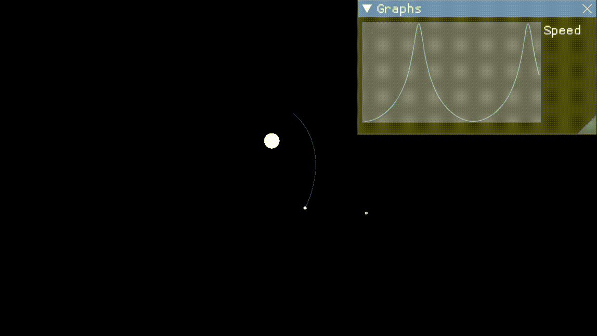

# gravity-sim-v2
Gravity simulator using Newton's Law of Universal Gravitation, made to teach physics

The goal is for this to run on the web and to otherwise be as easily accessible as possible.

Right click to show the GUI and press escape to hide it. Right clicking on a body shows a body-specific GUI.

# gifs

The start scenario has a simple orbit

You can graph various properties such as speed (more to come)

There are previews/predictions when you create a new body

The orbit changes due to integration error, but the timestep is adjustable

The GUI uses `imgui-rs`; using it you can create new bodies, adjust existing bodies, or change variables like the timestep.

Negative mass and negative timestep are cool

# details

Made with [`ggez`](https://github.com/ggez/ggez) and [`specs`](https://github.com/amethyst/specs)

Newton's Law of Universal Gravitation: 

Fully inelastic collisions in which the position of the collided body is decided by the mass weighted average position of the two collided bodies. The new radius is decided by adding the volumes.

Uses Verlet integration, with basic Euler integration energy is not conserved so orbits gradually increase in radius whereas with Verlet integration (and I think implicit Euler), all that happens is the orbits slightly shifting.
